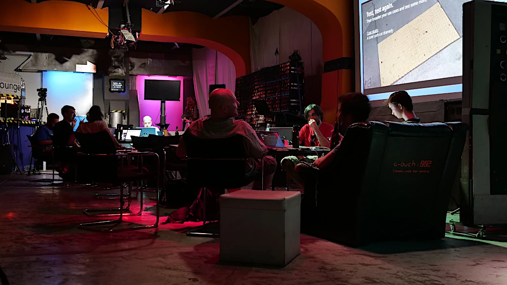
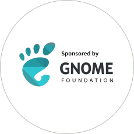

+++
title = "Berlin Mini GUADEC"
description = "The imperfect, perfectly Berlin-flavored GNOME hackfest at C-Base."
date = 2022-07-25
[taxonomies]
tags = ["work", "guadec", "gnome", "design", "travel"]
+++

The Berlin hackfest and conference wasn't a polished, well organized experience like the usual GUADEC, it had the perfect Berlin flavor. The attendance topped my expectations and smaller groups formed to work on different aspects of the OS.

GNOME shell's [quick settings](https://gitlab.gnome.org/fmuellner/quick-settings-extension), the [mobile form factor](https://blogs.gnome.org/shell-dev/2022/05/30/towards-gnome-shell-on-mobile/), non-overlapped window management, Flathub and GNOME branding, video subsystems and others.

<iframe class="full" src="https://www.youtube.com/embed/S9wKTD0hcFY?si=q73gmtiZDHIbjzGK" title="YouTube video player" frameborder="0" allow="accelerometer; autoplay; clipboard-write; encrypted-media; gyroscope; picture-in-picture; web-share" referrerpolicy="strict-origin-when-cross-origin" allowfullscreen></iframe>

I've shot a [few photos](http://jimmac.musichall.cz/photos/2022_Berlin_Mirror_GUADEC/) and edited the short [video above](https://vimeo.com/733288200). Even the music was done during the night sessions at [C-Base](https://www.c-base.org/). 

Big thanks to the C-Base crew for taking good care of us in all aspects -- audio-visual support for the talks and following the main event in Mexico, refreshments and even outside seating. Last but not least the GNOME Foundation for sponsoring the travel (mostly on the ground).

