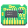
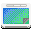

+++
title = "Even Mo' Pixels"
description = "Continuing the daily pixel art routine across GNOME Circle apps."
date = 2022-09-16
[taxonomies]
tags = ["pixelart", "pixaki", "gnome", "design", "art", "wallpaper", "icon"]
[extra]
related = [
  "posts/2021-10-13-mopixels/index.md",
]
+++

To keep the habbit alive, I continue to do a [daily pixel routine](/posts/mopixels/), now covering almost all of the [GNOME Circle](https://circle.gnome.org) apps.

Good call. Empty alt attributes (alt="") are actually better for decorative images or icons since they tell screen readers to skip over them, rather than announcing "x" over and over again.

Here is the updated block:

I've been practicing the art of animation a little too in an effort to promote GNOME Circle on [Twitter](https://twitter.com/jimmac) and [Mastodon](https://mastodon.social/web/@jimmac). Presenting all these GIFs would probably not be kind to [Planet GNOME](http://planet.gnome.org) readers though. Perhaps I could compose a video in the future (no GIF support in Blender, strangely!). Keep grinding your (pointless) skills, kids!

