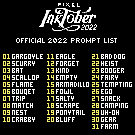
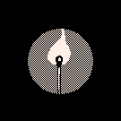
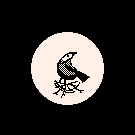
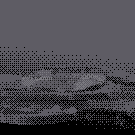
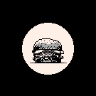
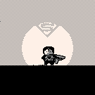
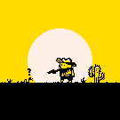
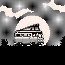

+++
title = "Pixel Inktober"
description = "Another October of quick pixel dailies, now posted on Mastodon."
slug = "pixel-inktober-2022"
date = 2022-10-31
[taxonomies]
tags = ["pixelart", "pixaki", "aseprite", "art"]
[extra]
related = [
  "posts/2021-11-01-pixel-inktober/index.md",
  "posts/2022-09-16-evenmopixels/index.md",
  "posts/2021-10-13-mopixels/index.md",
]
+++

Just like [last year](/posts/pixel-inktober/), October was filled with quick pixel dailies. I decided to only post [on mastodon](https://mastodon.social/@jimmac), but due to the twitter exodus couldn't quite post the 30kB images for the two remaining days. Good old blog post it is!

