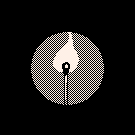

Just like [last year](), October was filled with quick pixel dailies. I decided to only post [on mastodon](https://mastodon.social/@jimmac), but due to the twitter exodus couldn't quite post the 30kB images for the two remaining days. Good old blog post it is!

{:.big}

{:.big}
{:.big}

{:.big}
{:.big}

{:.big}

{:.big}
{:.big}

{:.pixelicons}

[Previously](), [Previously](), [Previously]().
