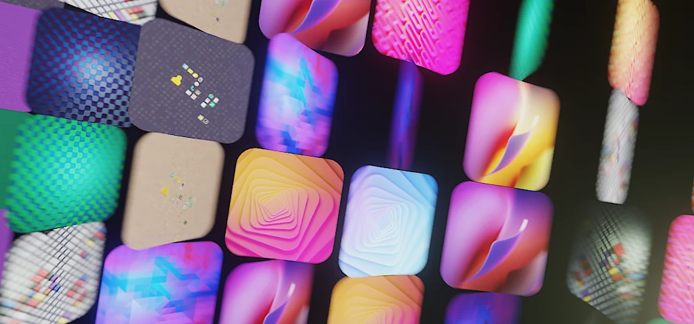

As we gear up for the release of GNOME 44, let's take a moment to reflect on the visual design updates.

We've made big strides in visual consistency with the growing number of apps that have been ported to gtk4 and libadwaita, embracing the modern look. [Sam](https://samuelhewitt.com/blog) has also given the high-contrast style in GNOME Shell some love, keeping it in line with gtk's updates last cycle.

The default wallpaper stays true to our brand, but the supplementary set has undergone some bolder changes. From the popular simple shape blends to a nostalgic nod to the past with keypad and pixel art designs, there's something for everyone. The pixelized icons made their debut in the last release, but this time we focus on [GNOME Circle](https://cicrcle.gnome.org) apps, rather than the core apps.

Another exciting development is the continued use of geometry nodes in Blender. Although the tool has a steep learning curve, I'm starting to enjoy my time with it. I gave a talk on geometry nodes and its use for GNOME wallpaper design at the Fedora Creative Freedom Summit. You can watch the stream archive recording [here](https://peertube.linuxrocks.online/w/iX9QkY4nCa2nPAzV8nC3BS?start=27m25s) (and [part2](https://peertube.linuxrocks.online/w/4kBcQfDBLAAJDQcdkDwZow)).

<iframe title="Visual Programming with Geometry Nodes in Blender - Jakub Steiner - Creative Freedom Summit 2023" src="https://peertube.linuxrocks.online/videos/embed/7f0043e0-a8ed-4f8c-a93b-e7da7c399bae" allowfullscreen="" sandbox="allow-same-origin allow-scripts allow-popups" frameborder="0"></iframe>

[Previously](),
[Previously](),
[Previously]()