+++
title = "Sketch Friday"
description = "Sharing app icon design sketches on Mastodon every Friday."
date = 2024-06-14
[taxonomies]
tags = ["art", "sketch", "procreate"]
+++

I've been posting a few sketches on [my mastodon](https://mastodon.social/@jimmac) every Friday. They are mostly sketches of [application icon design process](https://gitlab.gnome.org/Teams/Design/app-icon-requests/-/issues/43), but not always. Follow, like, subscribe!

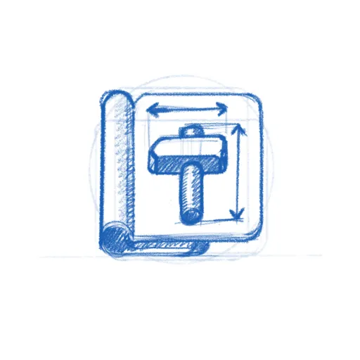
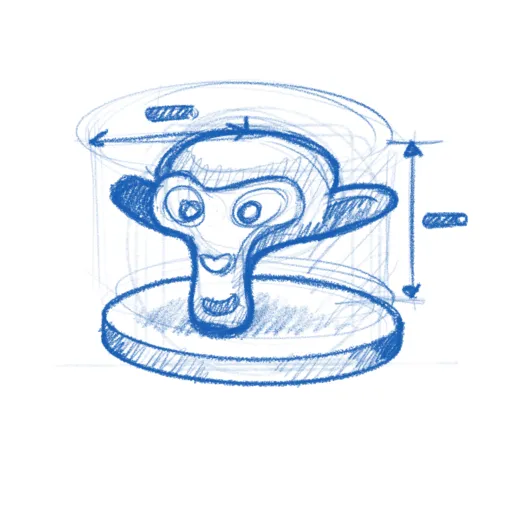
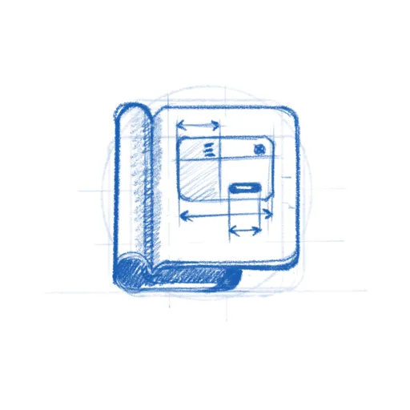

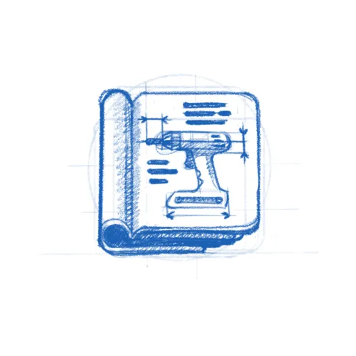

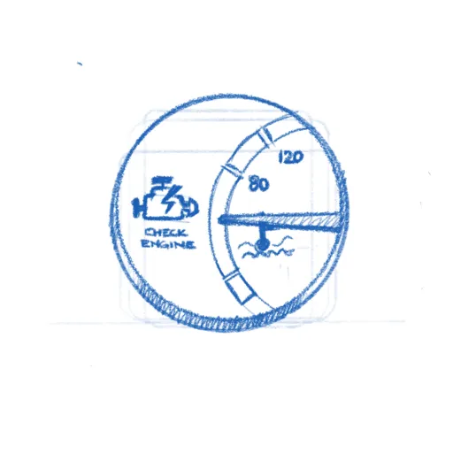

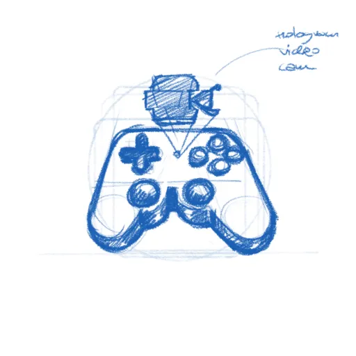
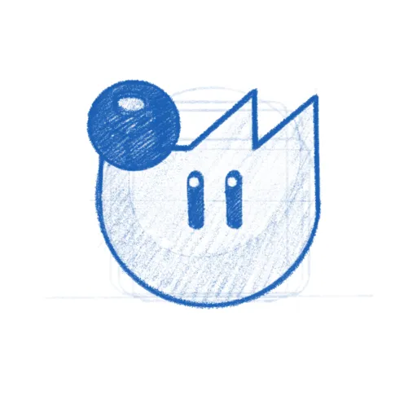

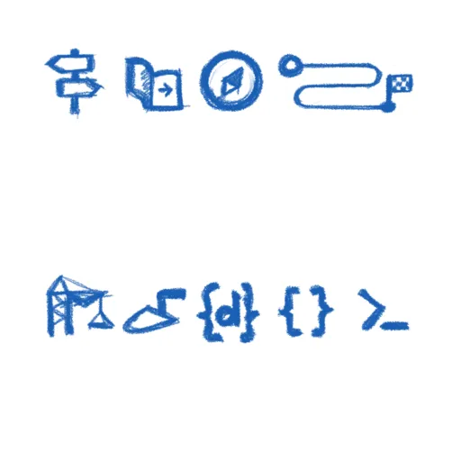

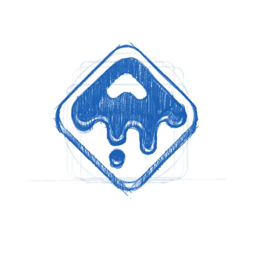

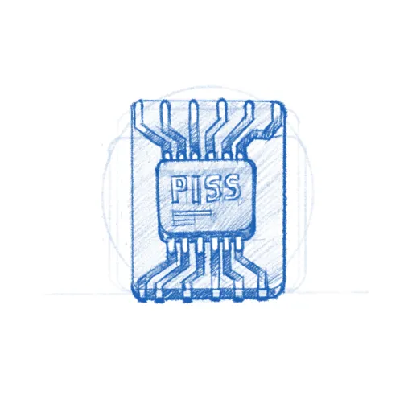

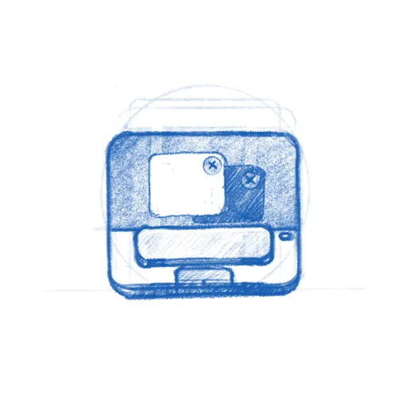

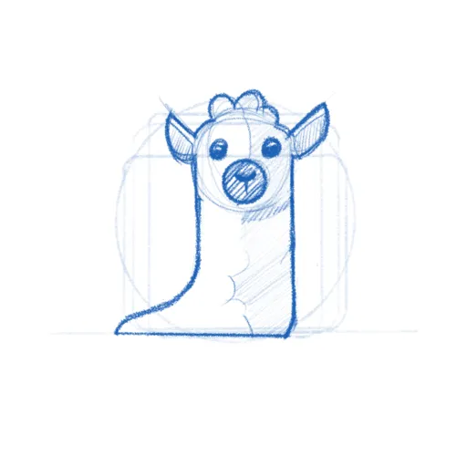

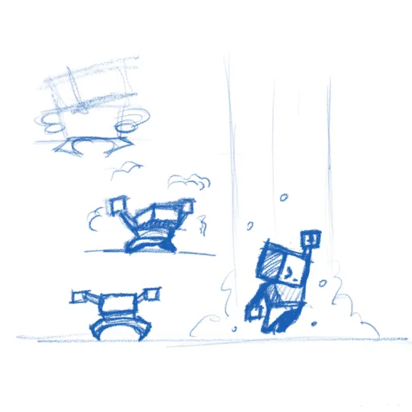
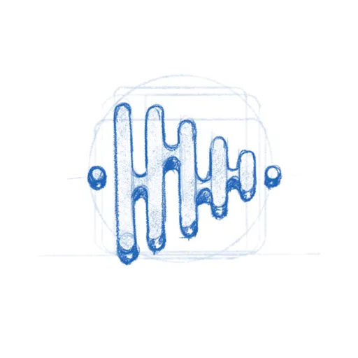

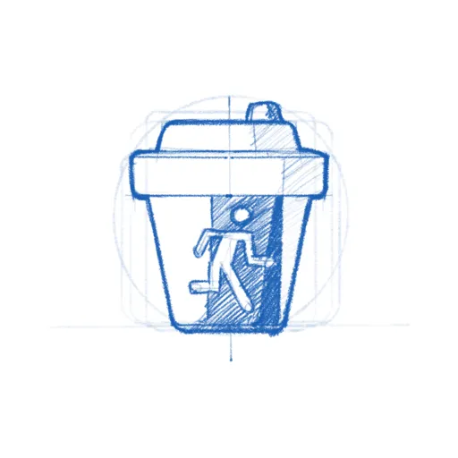

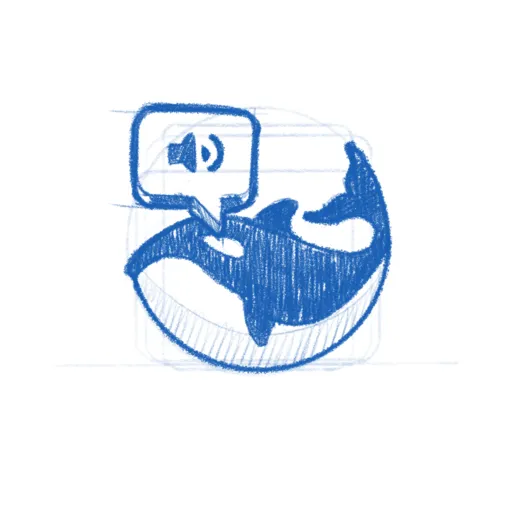

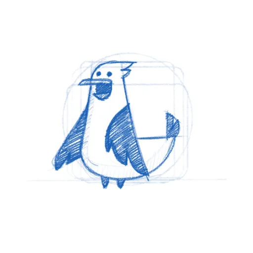

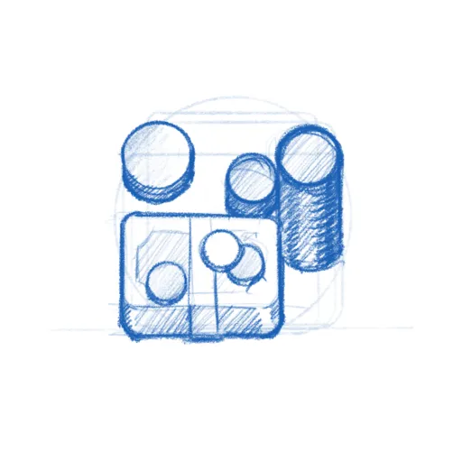

