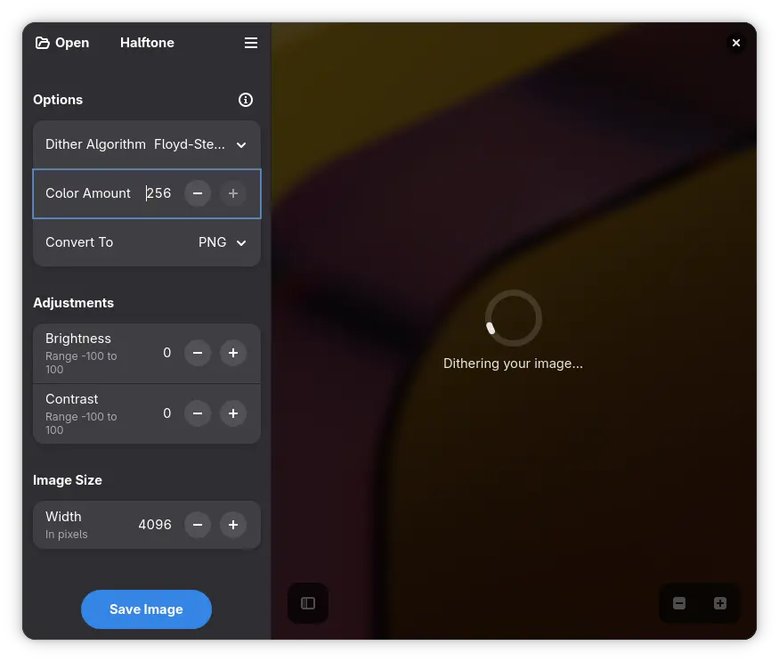
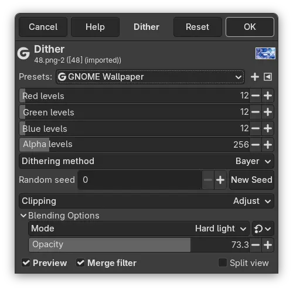

+++
title = "Dithering"
date = 2025-12-08
image = "halftone.webp"
[taxonomies]
tags = ["gnome", "wallpaper", "gimp", "work"]
+++

One of the new additions to the **GNOME 49** wallpaper set is *Dithered Sun* by [Tobias](https://tobiasbernard.com/). It uses dithering not as a technical workaround for color banding, but as an *artistic* device.

Tobias initially planned to use [Halftone](https://flathub.org/en/apps/io.github.tfuxu.Halftone) — a great example of a GNOME app with a focused scope and a pleasantly streamlined experience. However, I suggested that a custom dithering method and finer control over color depth would help execute the idea better. A long time ago, Hans Peter Jensen responded to my request for arbitrary color-depth dithering in GIMP by writing a custom GEGL op.

Now, since the younger generation may be understandably intimidated by GIMP’s somewhat… *vintage* interface, I promised to write a short guide on how to process your images to get a nice ordered dither pattern without going overboard on reducing colors. And with *only a bit of time* passing since the amazing GUADEC in Brescia, I’m finally delivering on that promise. Better late than later.

I’ve historically used the GEGL dithering operation to work around potential color banding on lower-quality displays. In Tobias’ wallpaper, though, the dithering is a core element of the artwork itself. While it can cause issues when scaling (filtering can introduce moiré patterns), there’s a real beauty to the structured patterns of Bayer dithering.

You will find the GEGL Op in `Color > Dither` menu. The filter/op parameters don’t allow you to set the number of colors directly—only the per-channel color depth (in bits). For full-color dithers I tend to use **12-bit**. I personally like the `Bayer` ordered dither, though there are plenty of algorithms to choose from, and depending on your artwork, another might suit you better. I usually save my preferred settings as a preset for easier recall next time (find `Presets` at the top of the dialog).

Happy dithering!
