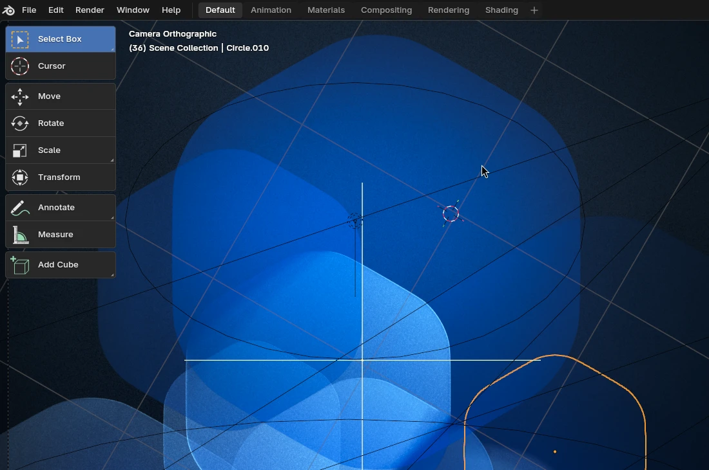
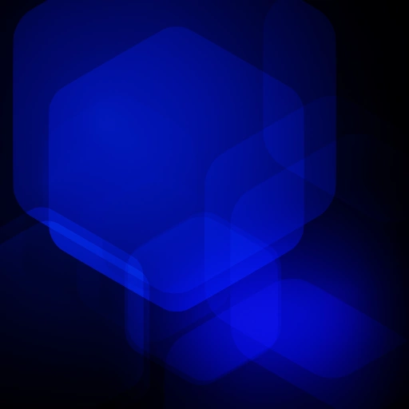
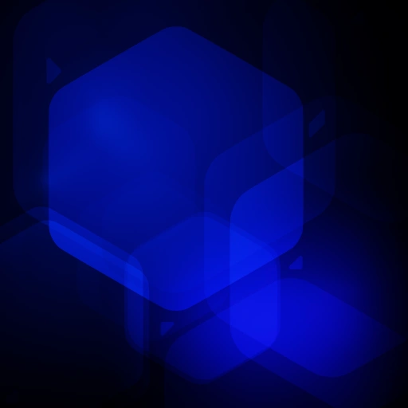
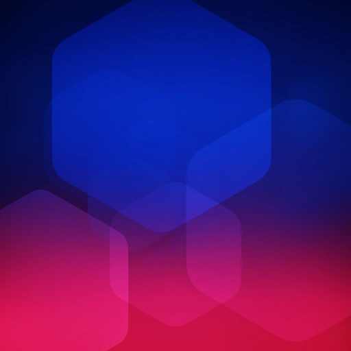

+++
title = "GNOME 50 Wallpapers"
description = "Hexagons finally claim the default spot in GNOME's wallpaper lineup."
date = 2026-03-18
slug = "gnome50-wallpapers"
[taxonomies]
tags = ["work", "gnome", "design", "wallpaper", "art", "blender"]
[extra]
image = "thumb.png"
mastodon_url = "https://mastodon.social/@jimmac/116252222590706940"
+++

GNOME 50 just got released! To celebrate, I thought it’d be fun to look into the background (*ding*) of the newest additions to the collection.

While the general aesthetic remains consistent, you might be surprised to see the default shifting from the long-standing triangular theme to **hexagons**. 

Well, maybe not *that* surprised if you’ve been following the `gnome-backgrounds` repo closely during the development cycle. We saw a rounded hexagon design surface back in 2024, but it was pulled after being deemed a bit too "flat" despite various lighting and color iterations. We’ve actually seen other hex designs pop up in 2020 and 2022, but they never quite got the **ultimate spot** as the default. Until now.

Beyond the geometry shift of the default, the **Symbolics** wallpaper has also received its latest makeover. Truth be told, it hasn’t historically been a fan favorite. I rarely see it in the wild in "show off your desktop" threads. Let's see if this new incarnation does any better.

<video controls muted autoplay loop class="image full">
<source src="timelapse.webm" type="video/webm">
<source src="timelapse.mp4" type="video/mp4">
</video>

Similarly, the glass chip wallpaper has undergone a bit of a makeover as well. I'll also mention a… let's say *less original* design that caters to the dark theme folks out there. While every wallpaper in GNOME features a light and dark variant, **Tubes** comes with a dark and *darker* variant. I hope to see more of those "where did you get that wallpaper?" on reddit in 2026.