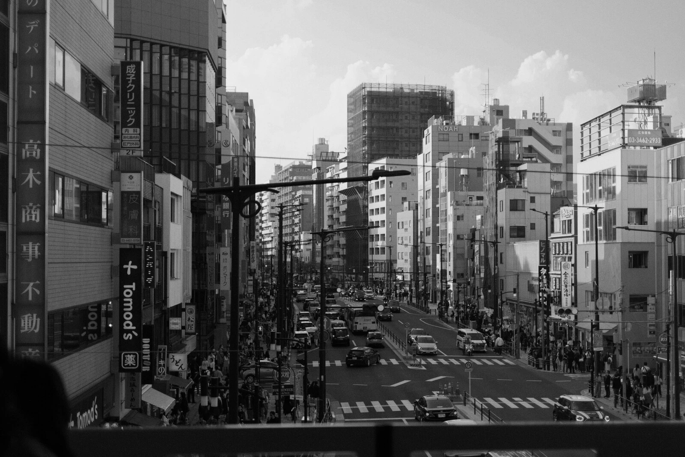

+++
title = "Japan"
description = "Visiting Japan is special. Skipping Tokio last time meant we had to come back."
date = 2026-04-05
[taxonomies]
tags = ["travel", "music", "japan", "photo"]
[extra]
image = "rain.webp"
mastodon_url = "https://mastodon.social/@jimmac/116353294692367877"
audio = "speech.opus"
+++

Last year we went to Japan to finally visit friends after two decades of planning to. Because they live in Fukuoka, we only ended up visiting Hiroshima, Kyoto and Osaka afterwards. We loved it there and as soon as cheap flights became available, booked another one for Tokio, to be legally allowed to cross off Japan as visited.

Now if I were to book the trip today, I probably wouldn't. It's quite a gamble given the geopolitical situation and Asia running out of oil. But making it back, it's been as good as the first one. Visiting only Tokio with a short trip to Kawaguchiko in the Sakura blooming season worked out great.

At the start of the year I promised myself to shoot my Fuji more. And I don't mean the volcano, I mean the my X-T20. I haven't kept the promise at all, always relying on the iphone. Luckily for the trip I didn't chicken out carrying the extra weight and I think it paid off. I did only take my 35mm, as the desire to carry gear has really faded away with the years. As we walked over 120km in the few days my back didn't feel very young even with the little gear I did have. 

While the difference in quality isn't quite visible on [Pixelfed](https://pixelfed.social/jimmac) or my [photo website](https://photo.jimmac.eu/) (I don't post to Instagram anymore), working through the set on a 4K display has been a pleasure. Bigger sensor is a bigger sensor.

Check out more photos on [photo.jimmac.eu](https://photo.jimmac.eu/20260402-210049) -- use arrow keys of swipe to navigate the set.

<audio controls>
<source src="GLITCHYCODE.mp3" type="audio/mpeg">
<source src="GLITCHYCODE.aac" type="audio/aac">
<a href="https://weeklybeats.com/jimmac/music/glitchy-code">Weeklybeats #13</a>.
</audio>

I also managed to get both of my weeklybeats tracks done on the flight so that's a bonus too!

Japan is probably quite difficult to live in, but as a tourist you get so much to feast your eyes on. It's like another planet. I hope to find more time to draw some of the awesome little cars and signs and white tiles and electric cables everywhere.

<audio controls>
<source src="AKIHABARA.mp3" type="audio/mpeg">
<source src="AKIHABARA.aac" type="audio/aac">
</audio>

