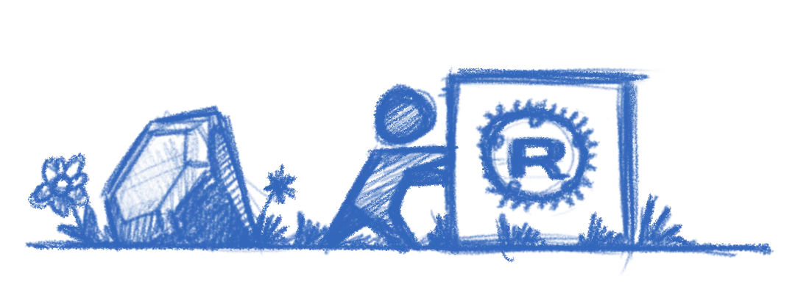

+++
title = "Moving to Zola"
description = "Finally ditching Jekyll for something modern."
date = 2026-04-10
[taxonomies]
tags = ["blog", "tech"]
[extra]
image = "zola.webp"
mastodon_url = "https://mastodon.social/@jimmac/116379797906555784"
+++

I've finally gotten around to porting this blog over to [Zola](https://www.getzola.org/). I've been running on Jekyll for years now, after originally conceiving this blog in [Middleman](https://middlemanapp.com/) (and PHP initially). But time catches up with everything, and the friction of maintaining Ruby dependencies eventually got to me. 

## The Speed

I can't stress this enough — Zola is *fast*. Not "for a static site generator" fast. Just fast. My old Jekyll setup needed a good few seconds to rebuild after a change. Zola builds in milliseconds. The entire site rebuilds almost before I can release the key. It's not critical for a site that gets updated 5 times a year, but it's still impressive.

## No Dependencies

This is the big one. Every time you leave a project alone for a few months and come back, you *know* it's not just going to magically work. The gem versions drift, Bundler gets confused, and suddenly you're down a rabbit hole of version conflicts. The only reason all our Jekyll projects were reasonably easy to work with was locking onto Ruby 3.1.2 using [rvm](https://rvm.io/). But at some point the layers of backwardism catch up with you.

Zola is a single binary. That's it. No `bundle install`, no Gemfile, no "works on my machine" prayers. Download, run, done. It even embeds everything — syntax highlighting, image processing, Sass compilation (if you haven't embraced the *modern CSS* light yet) — all built-in. The site builds the same on any machine with zero setup.

## The Heritage

Zola started life as **Gutenberg** in 2015/2016, a learning project for Rust by [Vincent Prouillet](https://www.vincentprouillet.com/). He was using Hugo before, but hated the Go template engine. That spawned [Tera](https://keats.github.io/tera/), the Jinja2-inspired template engine that Zola uses.

The project got renamed to Zola in 2018 when the name conflicts with Project Gutenberg got too annoying. It's pure Rust, which means it's fast, memory-safe, and ships as a tiny static binary.

## Asset Colocation

One thing I've always focused on for this blog architecture wise is the structure — images and media live right alongside the post, not stuffed into some shared `/images/` folder somewhere like most Jekyll sites seem to do. Zola calls this "asset colocation," and it's a first-class feature. No plugins needed. Just put your images in the same folder as your `index.md`, reference them directly, and Zola handles the rest.

This is how I'd already been running things with Jekyll, so the port was refreshingly painless on that front.

## The Templating

The main work was porting the templates. It was the main shostopper when Bilal suggested Zola a couple of years ago. I was hoping something with liquid to pop up, but it seems like people running their own blogs is not a Tik Tok trend. Zola uses Tera instead of Liquid. The syntax is similar enough to get by, but there's enough branches in your path to stumble on. The error messages actually make sense though and point you at the problem, which is a refreshing change from debugging broken Liquid includes.

## The Improvements

Beyond speed, I've been cleaning up things the old theme dragged along:

- **Dark mode without JavaScript**: The original Klise theme injected a script to toggle themes. The new setup uses CSS-only theming via custom properties, no flash of wrong theme, no JS required.
- **Legibility**: I'm getting older, and apparently so are my readers. Font sizes bumped up, contrast dialled in. What looked crisp at 30 looks muddy at 50.

The site's cleaner now, light by default, faster to build, and I don't need to invoke Ruby just to write a blog post. The experience was so damn good, it motivated me to jump at a much larger project I'm hopefully going to post about next.

[Previously](/posts/new-blog/).