+++
title = "120+ Icons and Counting"
description = "How the GNOME Design Team's app-icon-requests project has boosted app icon quality across the Linux desktop, and how you can help."
date = 2026-04-14
[taxonomies]
tags = ["design", "icon", "gnome", "work"]
[extra]
image = "thumb.webp"
mastodon_url = "https://mastodon.social/@jimmac/116401876030076912"
audio = "speech.opus"
related = [
  "posts/2026-03-19-friday-sketches/index.md",
  "posts/2024-06-14-sketch-friday/index.md",
]
+++

Back in 2019, we undertook [a radical overhaul](/posts/the-big-app-icon-redesign/) of how GNOME app icons work. The old Tango-era style required drawing up to seven separate sizes per icon and a truckload of detail. A task so demanding that only a handful of people could do it. The "new" style is geometric, colorful, but mainly *achievable*. Redesigning the system was just the first step. We needed to actually get better icons into the hands of app developers, as those should be in control of their brand identity. That's where [app-icon-requests](https://gitlab.gnome.org/Teams/Design/app-icon-requests) came in.

As of today, the project has received over a hundred icon requests. Each one represents a collaboration between a designer and a developer, and a small but visible improvement to the Linux desktop.

## How It Works

Ideally if a project needs a quick turnaround and direct control over the result, the best approach remains doing it in-house or commission a designer.

But if you're not in a rush, and aim to be a well designed GNOME app in particular, you can make use of the idle time of various GNOME designers. The process is simple. If you're building an app that follows the [GNOME Human Interface Guidelines](https://developer.gnome.org/hig/), you can [open an icon request](https://gitlab.gnome.org/Teams/Design/app-icon-requests/-/issues/new?issuable_template=request). A designer from the community picks up the issue, starts sketching ideas, and works with you until the icon is ready to ship. If your app is part of [GNOME Circle](https://circle.gnome.org) or is aiming to join, you're far more likely to get a designer's attention quickly.

The sketching phase is where the real creative work happens. Finding the right metaphor for what an app does, expressed in a simple geometric shape. It's the part I enjoy most, and why I've been sharing my [Sketch Friday](/posts/sketch-friday/) process on [Mastodon](https://mastodon.social/@jimmac) for over two years now ([part 2](/posts/friday-sketches/)). But the project isn't about one person's sketches. It's a team effort, and the more designers join, the faster the backlog shrinks.

## Highlights

Here are a few of the icons that came through the pipeline. Each started as a GitLab issue and ended up as pixels on someone's desktop.

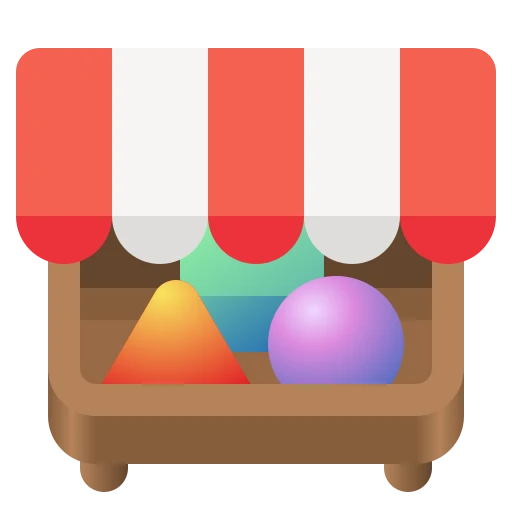
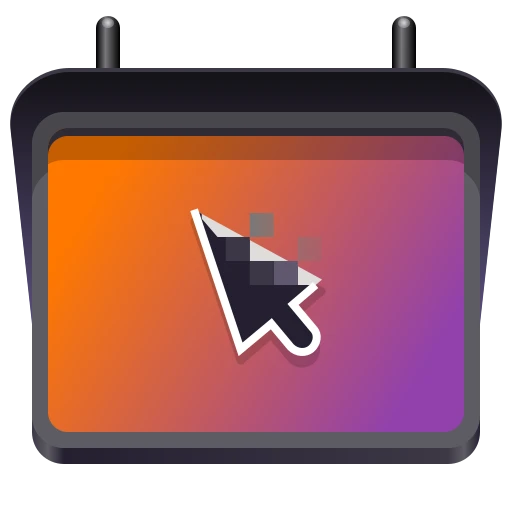
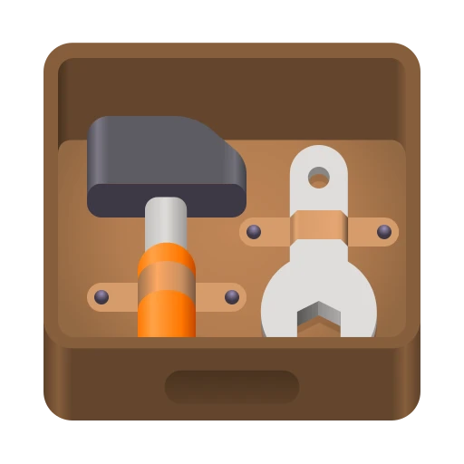
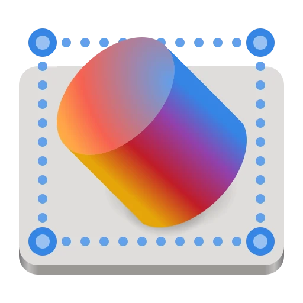

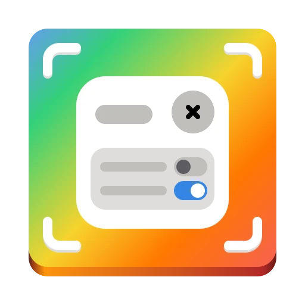

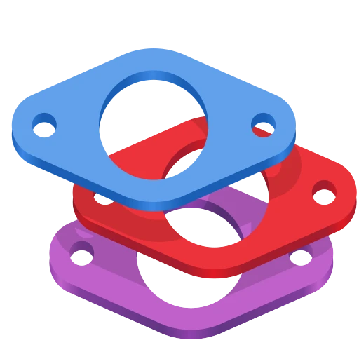

**[Alpaca](https://gitlab.gnome.org/Teams/Design/app-icon-requests/-/issues/55)**, an AI chat client, went through several rounds of sketching to find just the right llama. **[Bazaar](https://gitlab.gnome.org/Teams/Design/app-icon-requests/-/issues/99)**, an alternative to GNOME Software, took eight months and 16 comments to go from a shopping basket concept through a price tag to the final market stall. **[Millisecond](https://gitlab.gnome.org/Teams/Design/app-icon-requests/-/issues/100)**, a system tuning tool for low-latency audio, needed several rounds to land on the right combination of stopwatch and waveform. **[Field Monitor](https://gitlab.gnome.org/Teams/Design/app-icon-requests/-/issues/78)** shows how multiple iterations narrow down the concept. And **[Exhibit](https://gitlab.gnome.org/Teams/Design/app-icon-requests/-/issues/51)**, the 3D model viewer, is one of my personal favorites.

You can browse all [127 completed icons](https://gitlab.gnome.org/Teams/Design/app-icon-requests/-/issues?state=closed) to see the full range &mdash; from core GNOME apps to niche tools on [Flathub](https://flathub.org).

## Papers: From Sketch to Ship

To give a sense of what the process looks like up close, here's [Papers](https://gitlab.gnome.org/Teams/Design/app-icon-requests/-/issues/43) &mdash; the GNOME document viewer. The challenge was finding an icon that says "documents" without being yet another generic file icon.

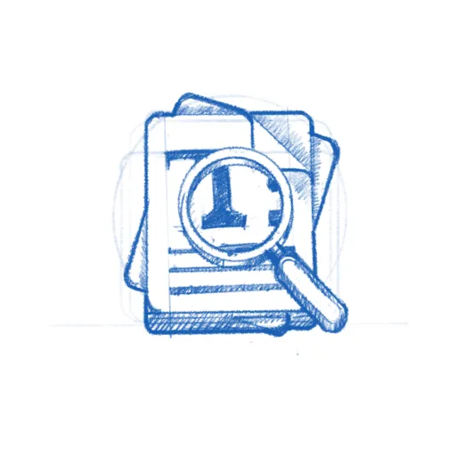
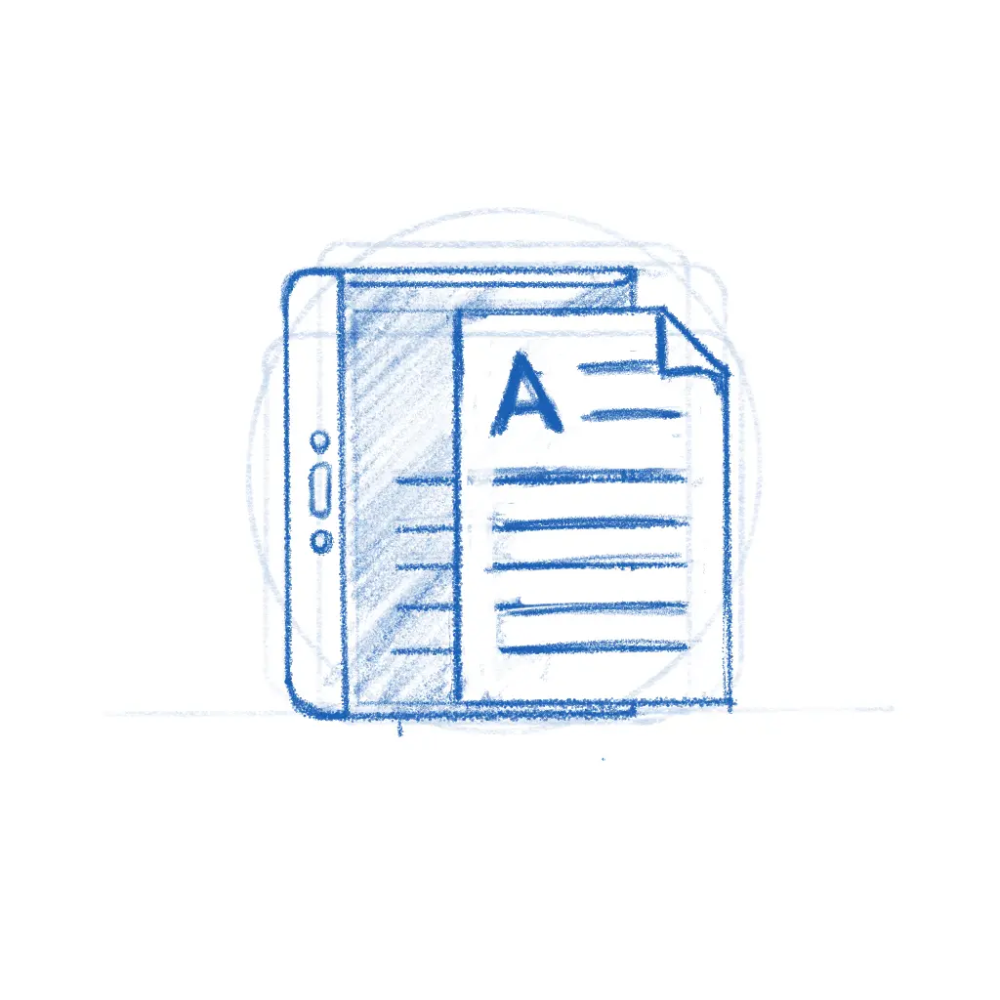
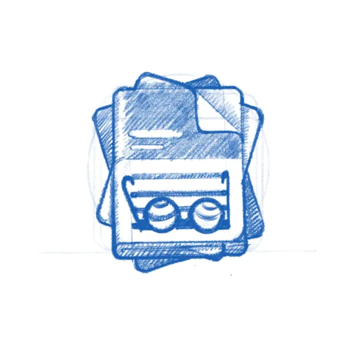
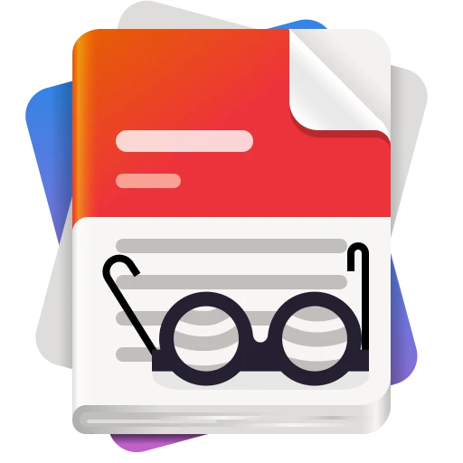

The early sketches explored different angles &mdash; a magnifying glass over stacked pages, reading glasses resting on a document. The final icon kept the reading glasses and the stack of colorful papers, giving it personality while staying true to what the app does. The whole thing played out in the [GitLab issue](https://gitlab.gnome.org/Teams/Design/app-icon-requests/-/issues/43), with the developer and designer going back and forth until both were happy.

While the new icon style is far easier to *execute* than the old high-detail GNOME icons, that doesn't mean every icon is quick. The hard part was never pushing pixels &mdash; it's nailing the metaphor. The icon needs to make sense to a new user at a glance, sit well next to dozens of other icons, and still feel like *this* app to the person who built it. Getting that right is a conversation between the designer's aesthetic judgment and the maintainer's sense of identity and purpose, and sometimes that conversation takes a while.

**[Bazaar](https://gitlab.gnome.org/Teams/Design/app-icon-requests/-/issues/99)** is a good example.

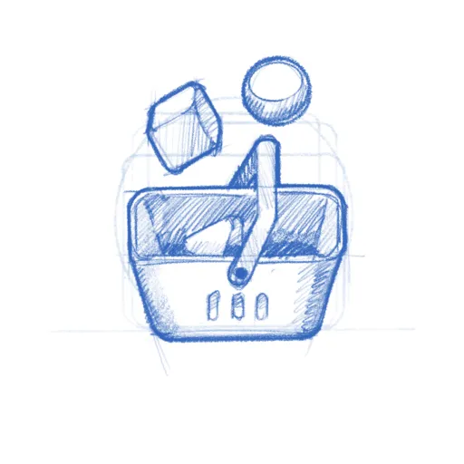
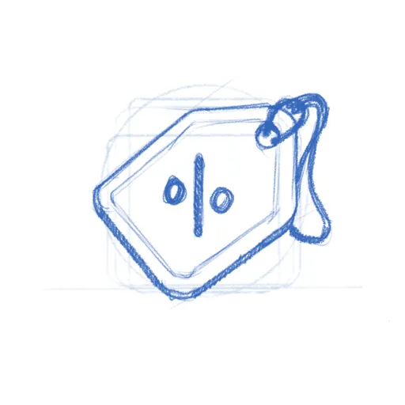
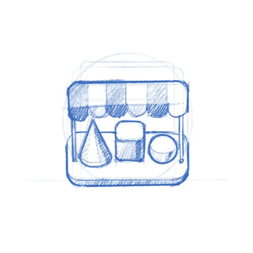

The app was already shipping with the price tag icon when [Tobias Bernard](https://tobiasbernard.com/) &mdash; who reviews apps for [GNOME Circle](https://circle.gnome.org) &mdash; identified its shortcomings and restarted the process. That kind of quality gate is easy to understate, but it's a big part of why GNOME apps look as consistent as they do. Tobias is also a prolific icon designer himself, frequently contributing icons to key projects across the ecosystem. In this case, the sketches went from a shopping basket through the price tag to a market stall with an awning &mdash; a proper bazaar. Sixteen comments and eight months later, the icon shipped.

## Get Involved

There are currently **[20 open icon requests](https://gitlab.gnome.org/Teams/Design/app-icon-requests/-/issues)** waiting for a designer. Recent ones like [Kotoba](https://gitlab.gnome.org/Teams/Design/app-icon-requests/-/issues/149) (a Japanese dictionary), [Simba](https://gitlab.gnome.org/Teams/Design/app-icon-requests/-/issues/148) (a Samba manager), and [Slop Finder](https://gitlab.gnome.org/Teams/Design/app-icon-requests/-/issues/147) haven't had much activity yet and could use a designer's attention.

If you're a designer, or want to become one, this is a great place to start contributing to Free software. The GNOME icon style was specifically designed to be approachable: bold shapes, a defined color palette, clear [guidelines](https://developer.gnome.org/hig/guidelines/app-icons.html). Tools like [Icon Preview and Icon Library](https://tools.design.gnome.org) make the workflow smooth. Pick a request, start with a pencil sketch on paper, and iterate from there. There's also a dedicated Matrix room `#appicondesign:gnome.org` where icon work is discussed &mdash; it's invite-only due to spam, but feel free to poke me in `#gnome-design` or `#gnome` for an invitation. If you're new to Matrix, the [GNOME Handbook](https://handbook.gnome.org/get-in-touch/matrix.html) explains how to get set up.

If you're an **app developer**, don't despair shipping with a placeholder icon. Follow the [HIG](https://developer.gnome.org/hig/), [open a request](https://gitlab.gnome.org/Teams/Design/app-icon-requests/-/issues/new?issuable_template=request), and a designer will help you out. If you're targeting [GNOME Circle](https://circle.gnome.org), a proper icon is part of the deal anyway.

A good icon is one of those small things that makes an app feel real &mdash; finished, polished, worth installing. Now that we actually have [a place](https://flathub.org) to browse apps, an app icon is either the fastest way to grab attention or make people skip. If you've got some design chops and a few hours to spare, pick an issue and start sketching.

## Need a Fast Track?

If you need a faster turnaround or just want to work with someone who's been helping out with GNOME's visual identity for as long as I can remember &mdash; [Hylke Bons](https://planetpeanut.studio/services#app-icons) offers app icon design for open source projects through his studio, Planet Peanut. Hylke has been a core contributor to GNOME's icon work for well over a decade. You'll be in great hands. 

His service has a great freebie for FOSS projects &mdash; funded by community sponsors. You get three sketches to choose from, a final SVG, and a symbolic variant, all following the GNOME icon guidelines. If your project uses an OSI-approved license and is intended to be distributed through Flathub, you're eligible. Consider [sponsoring his work](https://planetpeanut.studio/services#app-icons) if you can &mdash; even a small amount helps keep the pipeline going.
