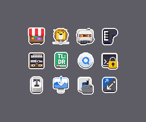
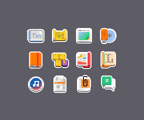
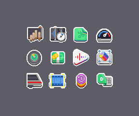
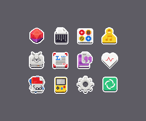
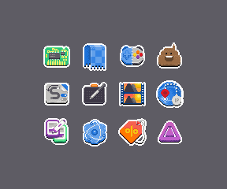
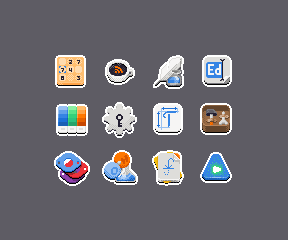
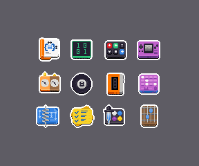

+++
title = "Revert That Vector Nonsense!"
description = "GNOME app icons were meant to be pixels. None of that SVG BS."
date = 2026-04-18T19:00:00
draft = true
[taxonomies]
tags = ["pixelart", "icons", "gnome"]
[extra]
image = "app-icons-crt-01.png"
related = [
  "posts/2021-06-22-pixels/index.md",
  "posts/2022-10-31-pixel-inktober/index.md",
  "posts/2021-10-13-mopixels/index.md",
]
+++

A few years back I did a [quick exploration](/posts/pixels/) of what GNOME app icons might look like in an alternate universe where we kept on using `VGA` displays. Chiselling pixels away is therapeutic. So while there is absolutely no use for these, I keep on making them if only to bring some attention to what really matters for GNOME, having nice apps.

Here's a batch of mostly [GNOME Circle](https://circle.gnome.org) app icons, with some [3rd party](https://flathub.org) ones thrown in. 

If you're reading this [on my site](/posts/app-pixels/) rather than [Planet GNOME](https://planet.gnome.org) or some flickering terminal in an abandoned Vault, then congratulations. You've stumbled upon a working Pip-Boy module! Found it half-buried under irradiated rubble, its phosphor display still humming with that familiar green glow. Enjoy these icons the way the dwellers of Vault 101 were always meant to, one glorious scanline at a time.

