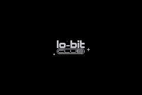
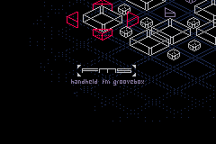

+++
title = "USS/FMS Carrier"
description = "Ess Mattisson made a tiny 2-op FM synth and sequencer for the Gameboy Advance, and it's brilliant."
date = 2026-05-09
aliases = ["/2026/fms-carrier/"]
[taxonomies]
tags = ["music", "tracker", "synth", "pixelart", "chiptune", "weeklybeats"]
mastodon_url="https://mastodon.social/@jimmac/116544702166472774"
[extra]
image = "Fms.png"
related = [
  "posts/2022-09-22-came-full-circle/index.md",
  "posts/2021-04-16-jammin-on-elektron/index.md",
]
audio = "speech.opus"
+++

I'm a sucker for pixel art and very constrained music grooveboxes. While I'm not into chiptunes, they sure are a cultural phenomenon.

You heard me boast about the [Dirtywave M8](https://dirtywave.com/) numerous times, even in person, because it's my tool of choice for producing and performing music. Its genius lies in high sound quality and a workflow that grew out of the tiny screen and button constraints on the Nintendo Gameboy, the platform of choice for an app called [LSDJ](https://www.littlesounddj.com/), which the M8 is modelled after. That, and the sheer amount of sound engines living in your pocket. Building on the shoulders of giants and all.

The small M8 community has a few 'celebrities', such as [Ess Mattisson](https://mtsn.se/). I first heard of Ess when I ran into an amazing *single channel* track called [Wertstoffe](https://www.youtube.com/watch?v=d6bJVcmFaNk). Ess has a great pedigree as the creator of the original [Digitone](https://www.elektron.se/wp-content/uploads/2024/09/Digitone_User_Manual_ENG_OS1.41_231108.pdf) FM synthesizer while working at [Elektron](https://www.elektron.se/). FM remains his forte, and after creating numerous plugins through [Fors](https://fors.fm/), he has now [released](https://lo-bit.club/fms) a little 2-operator FM synth and sequencer for the platform of the future, Nintendo Gameboy Advance.

What makes FMS a bit crazy is what it's doing under the hood. The Gameboy Advance has no FM synthesis hardware at all. Its audio gives you two Direct Sound DMA channels of 8-bit signed PCM — that's 256 amplitude levels, roughly 48 dB of dynamic range. For comparison, a CD has 96 dB, in much finer fidelity. The CPU is an ARM7TDMI running at 16.78 MHz with 256 KB of RAM, and that's where *all* the FM math happens. Sine waves, modulation, mixing four channels, all in real time, in software, on a chip from 2001 that was designed to shuffle sprites around. The hiss you hear is just part of the deal: quantization noise from that 8-bit DAC. So few amplitude steps means everything that comes out has this fuzzy, slightly crushed quality. You can't get rid of it. It *is* the sound. And somehow there are four channels of 2-operator FM synthesis in there, each with envelopes and ratio control. On a Gameboy Advance. 

<iframe class="full" src="https://www.youtube.com/embed/OvFURaZI1zY" title="FMS Carrier" frameborder="0" allow="accelerometer; autoplay; clipboard-write; encrypted-media; gyroscope; picture-in-picture; web-share" referrerpolicy="strict-origin-when-cross-origin" allowfullscreen title="First composition on the FMS, performed on the R35S handheld"></iframe>

Picking GBA as a platform of choice in 2026 may be strange. Surprisingly, it can be used on a very large array of hardware. Not only can you plug a memory card into the original hardware or new fancy clones like the [Analogue Pocket](https://www.analogue.co/pocket), you have an exponentially larger choice of dozens if not hundreds of Chinese emulator handhelds from [Anbernic](https://anbernic.com/), [Powkiddy](https://powkiddy.com/), [Miyoo](https://lomiyoo.com/) or [Retroid](https://www.goretroid.com/). You can also use the [Steam Deck](https://store.steampowered.com/steamdeck) or any PC running one of the many emulators, [RetroArch](https://www.retroarch.com/) being the most popular one.

FMS really touched me. Partly because I have a soft spot for the Nordic demo scene, but mainly for its novel approach to composition. Just like with the M8, creating basic building blocks and then applying transposition to break the looping monotony is my favorite workflow. This little thing has that in the form of pattern and trig transposition but also a novel take on "effects". Yes, you heard me right. There's a sorta-kinda-delay. Even does ping-pong stereo field.

I will keep on trying to create something that … sounds good. The process has been amazing. I truly love some of the sequencing tricks and workflows. The sequencer is, however, so good it would be worth seeing it run on top of a higher quality sound engine too.
