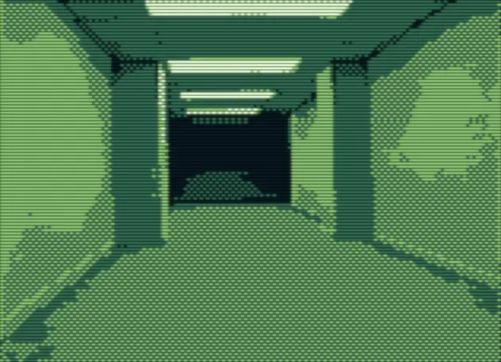

+++
title = "Backrooms"
description = "Not the best film ever, but in today's Hollywood landscape it’s a rare breath of fresh air."
date = 2026-06-03
aliases = ["/2026/backrooms/"]
[taxonomies]
tags = ["movie"]
[extra]
image = "backrooms.webp"
related = [
  "posts/2024-09-13-weyland/index.md",
  "posts/2025-05-22-scavengers-reign/index.md",
]

audio = "speech.opus"
+++

Not the best film ever, but in today's Hollywood landscape it's a rare breath of fresh air. Kane Parsons takes the internet meme concept he started on YouTube and actually makes a feature-length film that's doing great at the box office.

The mood is great. That unsettling stillness of these generic liminal spaces. For something that builds a feeling / mood, the flick would benefit from a butcher in the editing room. I'd probably still not give it the extra star, but this really isn't the kind of movie that needs the extra 20 minutes.

Biggest entertainment was definitely watching my son freak out in the third act. :)

★★★★☆