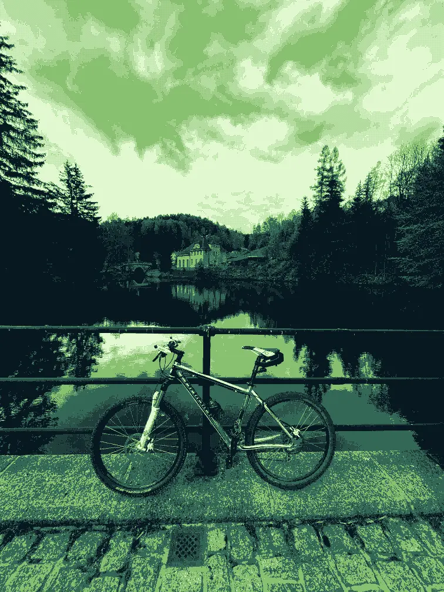

+++
title = "Things That Last"
description = "Bikes don't age."
date = 2026-06-17
[taxonomies]
tags = ["personal", "whenthingsworklikemagic", "design"]
[extra]
image = "bike.webp"
related = [
  "posts/2021-02-03-iphone12-mini/index.md",
  "posts/2021-09-06-magic-brick/index.md",
]
+++

One of the great annual trips we do with a bunch of friends is a train trip to Jakuszyce, a tiny stop in neighbouring Poland, and ride along the contour line through one of the most beautiful places in the Jizera Mountains. There's only one proper climb from Smedava to Knajpa, the rest is fast. A joyride. Catching up on our lives on the train and a joyride home is the best combo. 

I tend to think of myself as a friend of repairs, of making things last. I have sadly had to retire our washing machine after a good 25 years. The dishwasher before that served us more than 15. A boiler and heater had to go this year after about 20. I had my previous car for 13 years and felt like I was bailing too soon, even though there were quite a few issues with it at the end. None of those things ever felt new to me by the end. They most certaily showed their age.

But the bike. The bike I ride every year on that trip, the one leaning against the wall in the shed right now — it still feels like my "new bike". I replaced the tires and brake pads last year and the thing screams. It is such a joy to ride. It feels current, alive, like something I just picked out. Until a friend sent me a photo his Google Photos app reminded him of. A very young version of myself is sitting on that exact bike. Fifteen years ago. The same climbs, the same descents, the same frame. Nothing has aged except me. Bikes just don't age like we do.