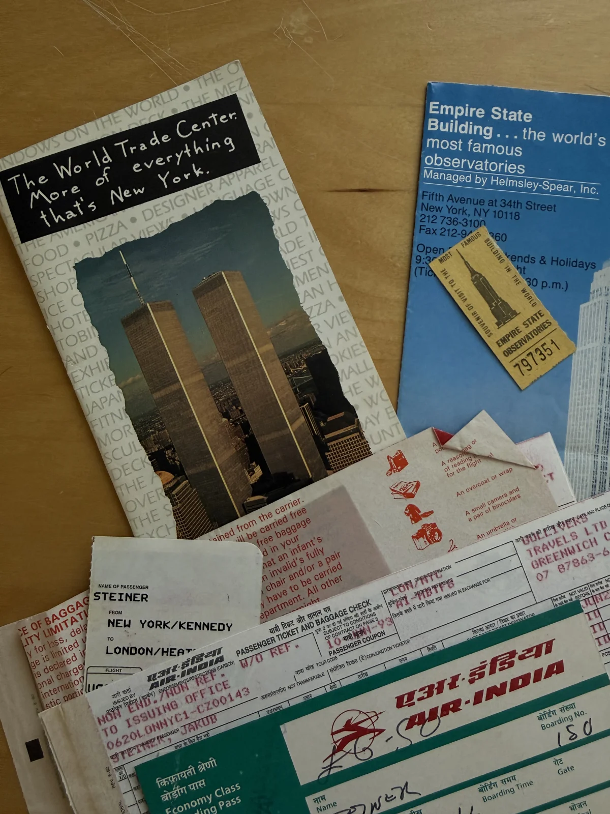
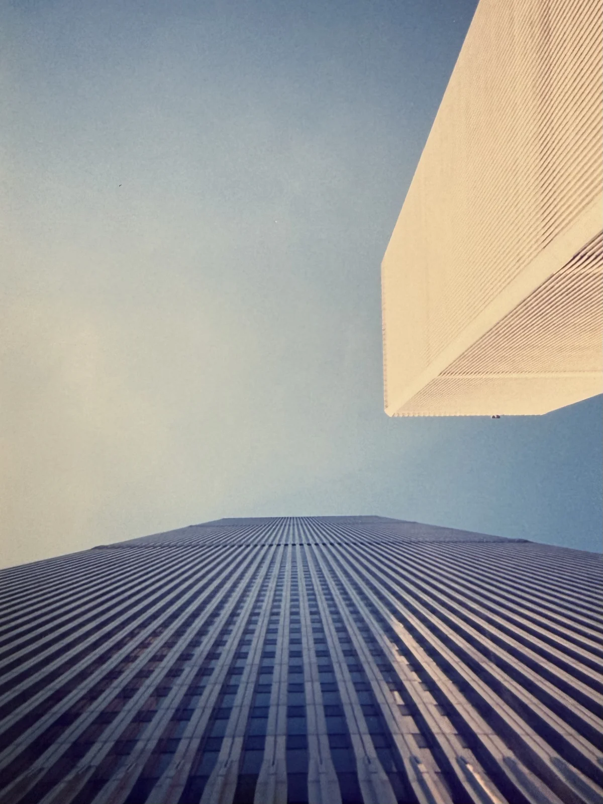
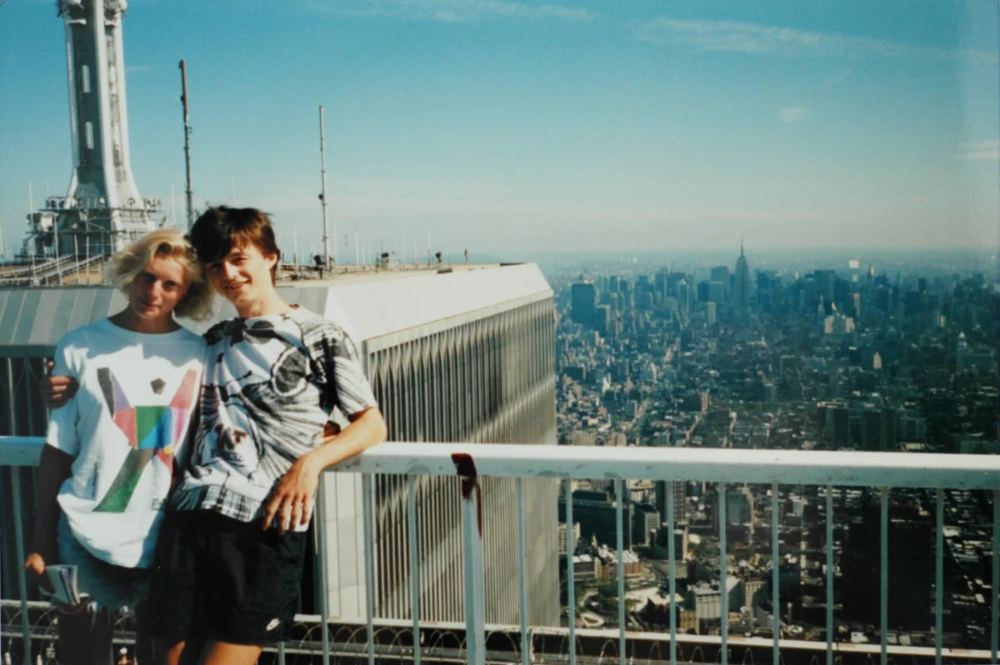

+++
title = "The other WTC Attack"
description = "February 26, 1993. Before 9/11, there was another attempt to bring down the Twin Towers."
date = 2026-09-10
[taxonomies]
tags = ["personal", "nostalgia", "blastfromthepast"]
[extra]
image = "wtc-1993-top.webp"
related = [
  "posts/2004-12-30-new-zealand-part-1/index.md",
  "posts/2016-01-29-rio/index.md",
]
+++

In 1993, I stood at the top of the World Trade Center feeling like being on top of everything. It was the culmination of my first proper trip west, a stark contrast to a country behind an iron curtain or even a small-town Amherst, New Hampshire, where I had to earn my way into that adventure.

Many people can't wrap their heads around how such enormous buildings could collapse on September 11. What I can't wrap my head around is that they survived the first attack, which happened in February of '93, when I was, entirely oblivious to what had happened on the ground floor a few months earlier, soaking in those panoramic views.

The attack was carried out by a group of radicals led by mastermind Ramzi Yousef. In the underground parking garage of the North Tower, they detonated a yellow Ford van packed with explosives. It's often claimed that the terrorists used Czechoslovak Semtex, but in reality it was a massive, roughly 600-kilogram homemade explosive charge, further reinforced with pressurized hydrogen tanks. Semtex was only a trigger explosive.

The explosion was devastating. The blast tore a 30-meter crater through five floors of underground parking and damaged several support columns, though the main structural frame of the tower held. Though the tower didn't collapse as the terrorists had originally planned, the shockwave destroyed the main electrical wiring and emergency lighting, and smoke rose as high as the 93rd floor. Six people lost their lives and more than a thousand were injured, most from smoke inhalation during the grueling evacuation through dark stairwells. Operations in both towers were completely paralyzed and the complex had to be shut down for nearly a full month. Total damages and subsequent repairs cost roughly half a billion dollars.

Because of the '93 bombing, the Port Authority installed photoluminescent safety markings along the steps, landings, and handrails throughout the towers. When the planes struck eight years later and emergency lights flickered or failed, these glow-in-the-dark strips guided occupants downward. According to National Institute of Standards and Technology, 33% of survivors in the North Tower and 17% in the South Tower directly credited these markings with aiding their escape. The stairs were well-lit by battery-pack emergency lights and photoluminescent guides, and people moved much faster. Survivors who had been in the building during both attacks noted that the 2001 descent took roughly half the time it did in 1993.

I only know about all of this because of the internet — a firehose of news and dangers pouring at me every hour of every day. Could I stand up there today, soaking in those fantastic views, still so oblivious and happy?
