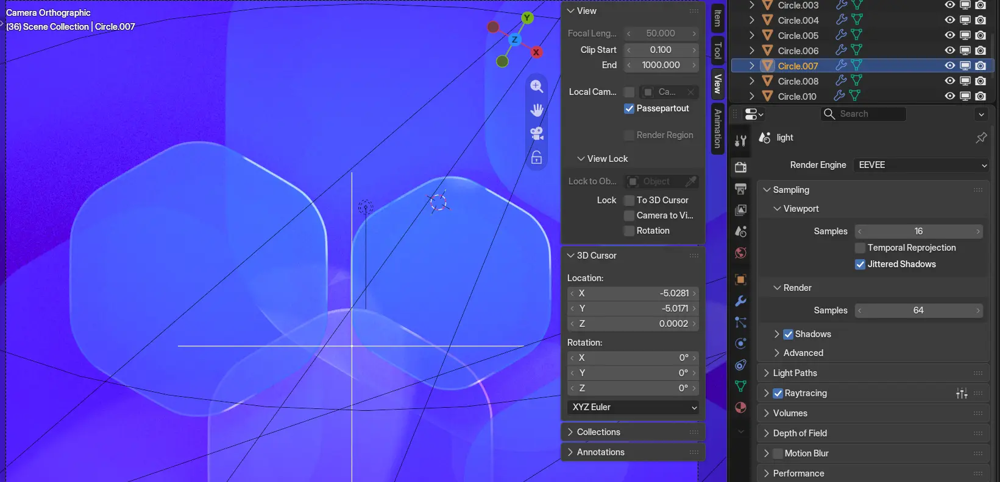
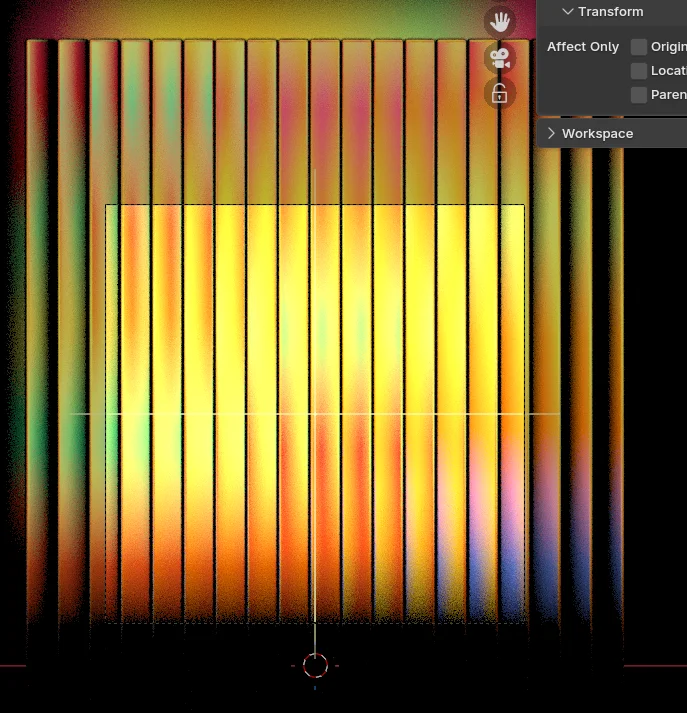

+++
title = "GNOME 51 Wallpapers"
description = "GNOME 51 comes with some touch ups and newly added wallpapers."
date = 2026-09-16
aliases = ["/2026/gnome51-wallpapers/"]
slug = "gnome51-wallpapers"
[taxonomies]
tags = ["work", "gnome", "design", "wallpaper", "art", "blender"]
[extra]
image = "thumb.webp"
mastodon_url = "https://mastodon.social/@jimmac/117281348845055008"
related = [
  "posts/2026-03-18-gnome50-wallpapers/index.md",
  "posts/2025-09-17-wallpapers/index.md",
  "posts/2024-09-24-wallpapers/index.md",
  "posts/2024-03-07-gnome46-wallpapers/index.md",
]
audio = "speech.opus"
+++

With GNOME 51 out the door, it's wallpaper reveal season again. This time around it's *evolution, not revolution* — the set sticks to its geometric roots.

The default is really just a stylistic touch up of the 50 hexagons. The subtle rim highlight received a spotlight and now shines extra bright.

I do keep hoping landscape nature photos eventually join the lineup, but capturing the same scenery under different conditions so the light and dark variants actually make sense is trickier than it sounds. That one's still on the [wishlist](https://gitlab.gnome.org/GNOME/gnome-backgrounds/-/work_items/20).

<video nocontrols muted autoplay loop class="full rounded">
<source src="gnome-51-wallpapers-featurette-small.webm" type="video/webm">
</video>

As usual, plenty of concepts didn't make the cut. For every wallpaper that ships, there's a good pile of experiments that never got past the "that's kinda neat" stage.

One thing we keep struggling with is performance in the Appearance panel. The images now include an embedded small thumbnail, so hopefully a faster way to build the initial cache of thumbnails is [on the horizon](https://gitlab.gnome.org/GNOME/gnome-control-center/-/work_items/3167).

We've also started embedding attribution and license straight into the images themselves, so the credits travel with the file instead of living only in the repo. And with [Loupe displaying the metadata nicely](https://release.gnome.org/51/#image-viewer), you get to see it conveniently.
