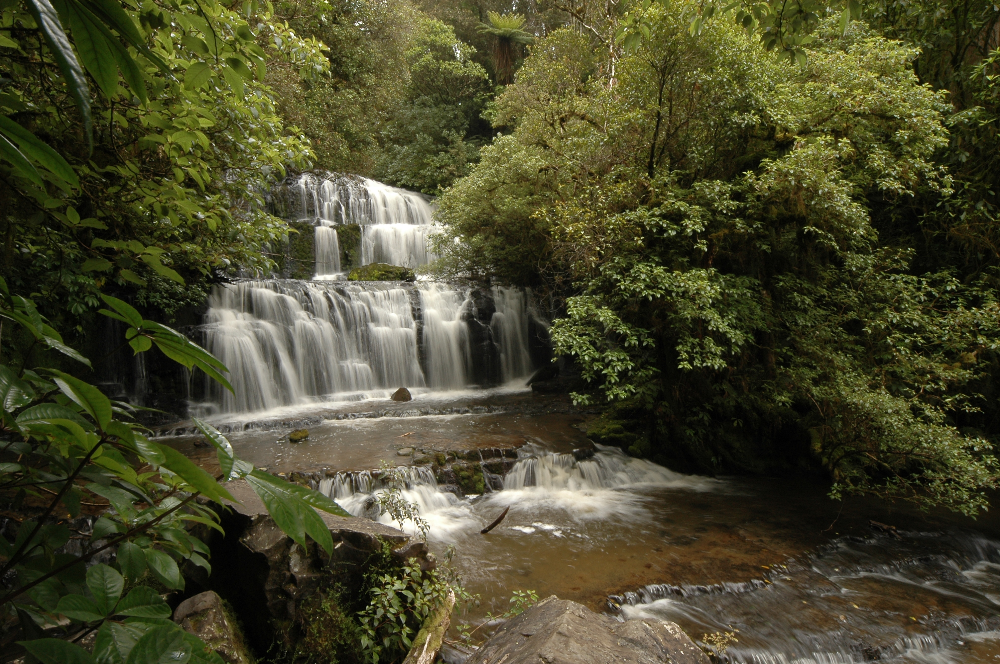
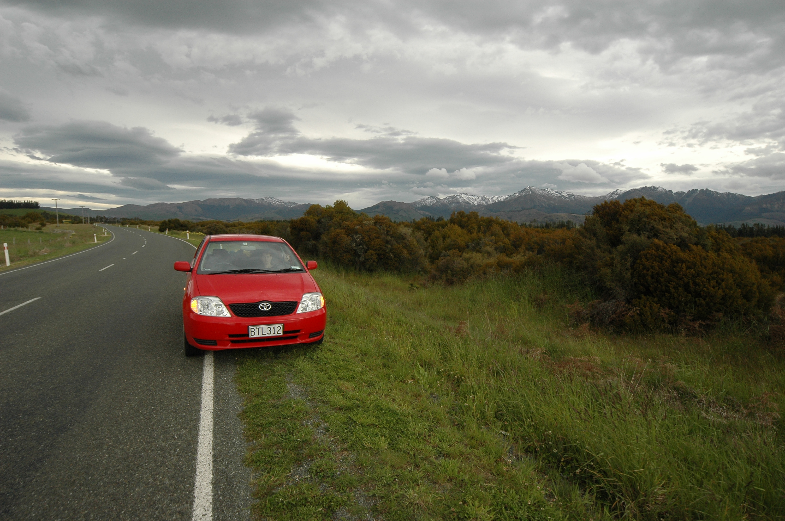
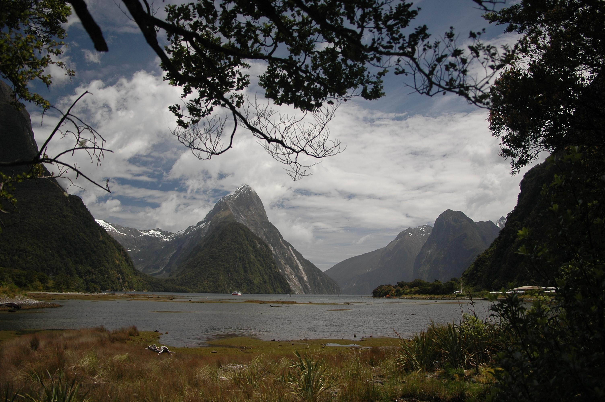

The farm we stayed at was really close to the nice Purakaunui falls. Met some photographers there and they obviously didn't think much of my "why carry a tripod when I can just stick the cam on a railing, eh?". The method works really well for the lazy bastards like myself though. Especially when I saw a poor fella carry around a big camera bag on the Tongariro crossing track.
Yuck.

We visited a few places on the way, like the McLeans falls which I found more appealing than Purakanui which were listed as the most photographed one on the south island. Them tourist guides. The wind almost blew us away at the fossil forest at Curior Bay. It's not much exciting on the photos though. We stayed overnight in Te Anau, preparing for what became one of the highlights of
our trip - Milford Sound.

Everybody was telling us we should expect a rain, since it almost always rains at Milford Sound. Well I guess we were lucky, since we had a lovely day from the early morning. The trip there alone was miraculous and we had to make a stop every few minutes. You'll be driving the same road back so you can stop at places you missed ;).

The boat trip was quite nice, but I enjoyed the time on the land more. We regret we didn't go on the 3 day track, but it's a weather gamble.