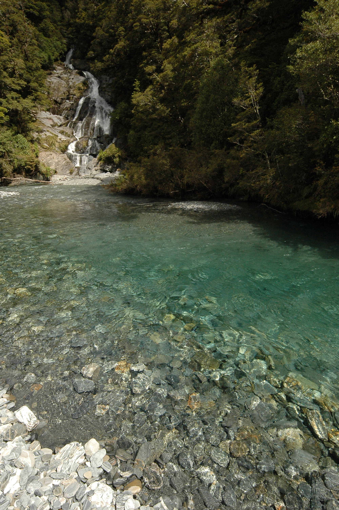
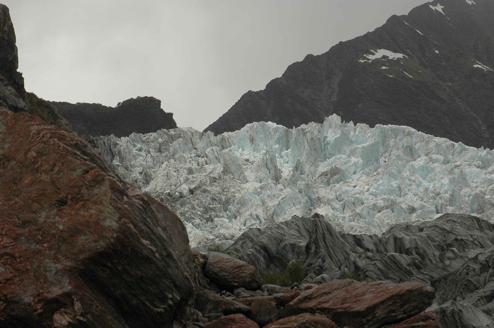
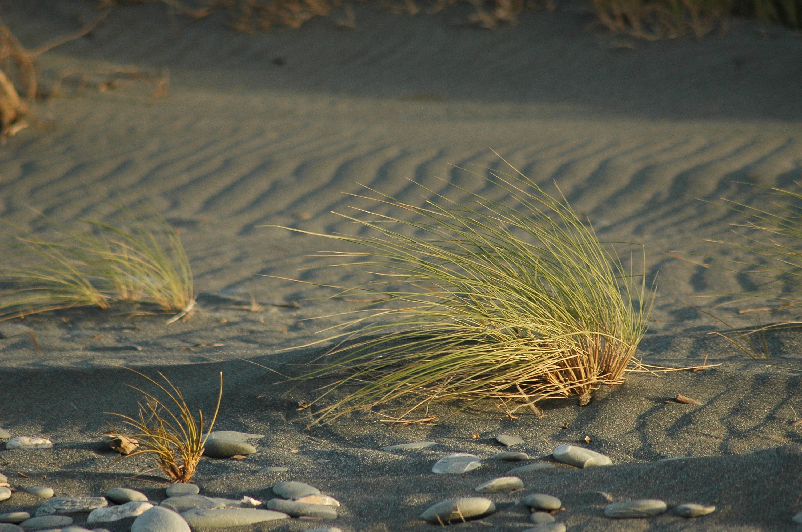

From the beatiful sights of Milford Sound we went to the Circus Town, err Queenstown. It's packed with rollercoaster attractions like speedboats, bungee, tandem skydiving etc. But since I'm not much of an adrenalin person, we did the jetboat thing and continued north west, to the glaciers. We chose to climb the Fox glacier simply because it was cheaper, but visited Franz Josef the next day too.

From there we continued north to Punakaiki. I managed to get a few shots of a kiwi-like bird which turned out to be the [weka](http://en.wikipedia.org/wiki/Weka). Even when the weather is playing games with you, New Zealand is really marvelous for giving you a number of fantastic scenic views. That place is simply heaven for nature photographers.

